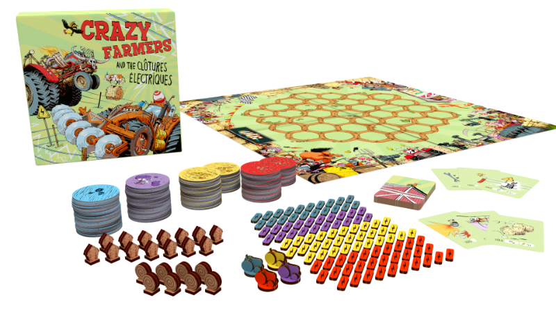

# Crazy Farmers and the Clôtures Electriques

This repository has moved to Codeberg: https://codeberg.org/thinkbeforecoding/crazy

You'll find here the code of Crazy Farmers and the Clôtures Electique, a board game I've been working on as an author and is [currently on Kickstarter](https://www.kickstarter.com/projects/1486112993/crazy-farmers-and-the-clotures-electriques?ref=3gajzr). You'll also find the code of **Peeble**, a F# to Php transpiler, and the code for the Board Game  version, that has been created using **Peeble**.

## The game

2042 European subsidies for Agriculture have long vanished into thin air. A recent study revealed that farmers survive on an average of 42 euros a month. Political authorities may have turned their backs on them, farmers refuse to live as castaways, ignored by all. They soon come up with a crazy idea that would put them right in the spotlight: create a new sport combining the extravaganza of wrestling, the raw power of Monster Trucks & their love for agriculture. They would need spectacular shows, noise, fury, gloss & glitter. Old tractors would reclaim their rightful place with a full make-over, evolving into crazy machines bringing fear & dreams to the hearts of the public.

And this is how the Ultimate Farming Championship (UFC) was born.

Trash TV & mass media got onboard almost instantly. In just a few months’ time, UFC became huge. From big cities to small villages, all wanted their own arena. From outcasts, farmers became stars, worshipped and envied.

Crazy Farmers is a fun and wacky strategic game of placement & territory conquest.
Jump on your customized tractor and lay electric fences to circle plots to add them to your territory. The farmer with the largest field at the end of the game wins it all. But be careful, your opponents will have many tricks up their sleeves to get in your way.

Fame and glory is only a fence away so be sly, think hard and show no mercy. Let’s bring on the Craziness and Make Agriculture Great Again!

## The Kickstarter

With our publisher [The Freaky 42](https://www.facebook.com/TheFreaky42/), we've launched a Kickstarter on June 18th for the board game.

You can support our effort to create low carbon footprint but still fun games by pledging:

[The Kickstarter campain page](https://www.kickstarter.com/projects/1486112993/crazy-farmers-and-the-clotures-electriques?ref=3gajzr)

## The online version

When launching a boardgame, we usualy go to Festivals or organise events in caffés and bars to let people discover the game. But with the global health situation and quarantine, all events have been cancelled. This reduced to almost 0 our capacity to present the game to new players.

So I decided to code as quickly as possible an online version, using the tools I know best. For larger reach, I decided to develop the game for the browser using websockets to synchronise players. Fable Elmish Bridge has been an excellent choice to go from the idea to realisation in less than 3 weeks.

## Board Game Arena

Seeing the online version, I've been invited by [Board Game Arena](https://boardgamearena.com/gamepanel?game=crazyfarmers) to port it to there platform that has a very large audience.

You can play with your friends or with other BGA players using a free account:

[Crazy Farmers on Board Game Arena](https://boardgamearena.com/gamepanel?game=crazyfarmers)

It was a very interesting offer, but there was a double challenge:

* The code had to be in Php
* I had never written a line of Php in my life

An option was to rewrite everything from scatch in Php. But I knew from writting it already in F# that this was a difficult task. And that would mean use a different implementation in the browser and on the server, whereas using Emish Bridge I had the same code on both side.

The other option was to transpile F# to Php...

## Peeble

Peeble is a prototype transpiler from F# to Php. It takes F# files and generate Php code that does the same thing, the same way Fable does from F# to Javascript.

I built it using some come of Fable. Fable first convert F# to an intermediary representation, the convert this representation to Bable that actually generate the JS.

In Peeble, Fable converts the F# to the same intermediary model. This model is closer from JS, but not very different from contruct that can be found in Php.

Peeble then generate a Php abstract syntax tree, and output it as Php code.

As you'll see, this is still a prototype. Some F# construct have not been tested. But it manage to convert 2600 lines of non obvious F# like a charm. 

I implemented FSharp list, seq, array, Map, Set and some other fonctions manually to provide needed FSharp.Core structures in Php.

The result code is actually very fast and not too hard to read (equivalent to JS generated by Fable).

## Event Sourcing

One of the key point to implement the game quickly and be able to port is as easily to another language **and** platform, was the choice for Event Sourcing.

### Storage

The first online version was using Cosmos db for persistence. Using change subscription, I was able to subscribe on many containers instances. This way, clients can be connected on different container instances, and get notified of changes.

On BGA, I had to use MySql. But storing events is a single table with a simple schema. I could just serialize/deserialize blobs from the table. No specific subtlety was needed. 

### WebSockets/Players synchronization.

Using Elmish.Bridge, I could simply propagate events on the websocket, and fold them on previous state on the client. It's even better than that. The state being immutable, when a player performs an action, we can compute the new state locally, but keep the last state computed from server events. when receiving events from the server, the locally computed version is replaced by the one computed with the events from the server. This make the feactivity better since the client is updated before sending command to the server. If the server sends a different outcome that computed locally, it will be corrected when receiving the update from the server.

On BGA, there is a notification API to push information to player's browser. I just pushed the serialized events, and use them in the JS code exactly the same way.

## Conlusion

I hope this code can inspire you, and can only encourage you to try the [Board Game Arena version](https://boardgamearena.com/gamepanel?game=crazyfarmers).
And of course if you like it, [back us on Kickstarter](https://www.kickstarter.com/projects/1486112993/crazy-farmers-and-the-clotures-electriques?ref=3gajzr)
